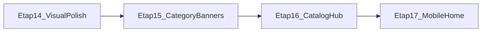

# План: полірування вітрини + банери каталогу

Оновлено після узгодження: **спочатку візуал і баги**, потім **банери через адмінку**, **hub `/catalog` — в кінці**.

---

## Порядок етапів

| # | Етап | Мета |
|---|------|------|
| **14** | Полірування UI вітрини (баги + візуал) | Стабільний вигляд усіх ключових сторінок desktop |
| **15** | Банери сторінок каталогу (адмінка) | Картинка + тексти банера для категорій з API |
| **16** | Hub `/catalog` (адмінка) | Керовані плитки / банер hub |
| **17** | Мобільна головна (§7.10) | Після desktop-полірування |

---

## Етап 14 — Полірування UI вітрини

### Відомі проблеми (з коду)

| Де | Проблема |
|----|----------|
| `MalvaGardenCatalogDesktop` | Один захардкожений `hero-kvity.png` на всі розділи каталогу |
| `MalvaGardenCatalogDesktop` | `object-position` підганяє кадр замість окремого ассета банера |
| `/catalog/kvity` (корінь) | Не підтягує `name`/`description` з API — дефолтні «Квіти» |
| `MalvaGardenCatalogHubDesktop` | Плитки з однаковими/заглушковими зображеннями |
| `MgCartToast` | Помилка додавання в кошик — той самий зелений toast |
| `FigmaStoreSearch` | a11y: `aria-expanded` на `input` (lint warning) |
| `useFloatingListPosition` | ✓ після швидкого скролу dropdown зсувався (stale React state + анімація `is-scrolled`) |
| Різні сторінки | Дублювання layout-логіки (крихти, контейнер `#E7F1F3`, відступи) |

### Область робіт (пріоритет)

1. **Каталог** — `/catalog/kvity`, `dekoratyvni-kushi`, `dekoratyvni-travy`, підкатегорії, `/search`
2. **Головна** — `/` (desktop)
3. **Товар** — `/product/[slug]`
4. **Кошик / checkout / ЛК** — дрібні вирівнювання, стани помилок/порожніх
5. **Інфо-сторінки** — типографіка контенту з адмінки

### Технічні кроки

| Крок | Що зробити | Файли |
|------|------------|-------|
| 14.1 | Аудит + чеклист багів (staging + локально) | `docs/QA_TEST_PLAN.md` (доповнити) |
| 14.2 | Виправити банер каталогу **тимчасово**: різні fallback-зображення per `activeNavSection` (до етапу 15) | `MalvaGardenCatalogDesktop.tsx` |
| 14.3 | Підтягнути `sectionTitle` / `sectionDescription` з `GET /categories/:slug` на кореневих сторінках розділів | `catalog/kvity/page.tsx`, `dekoratyvni-*/page.tsx`, `loadCatalogPage.ts` або helper |
| 14.4 | Винести спільний **`CatalogPageChrome`** (крихти + контейнер + банер-slot) | новий компонент у `components/figma/catalog/` |
| 14.5 | Уніфікувати сітку каталогу: gap, порожній стан, пагінація | `MalvaGardenCatalogDesktop`, `CatalogPaginationNav` |
| 14.6 | Toast: окремий стиль для помилок (`MgCartToast` / `cart-ui-events`) | `MgCartToast.tsx`, `globals.css` |
| 14.7 | `FigmaStoreSearch`: a11y + вирівнювання dropdown | `FigmaStoreSearch.tsx` |
| 14.8 | Дрібне полірування головної / товару / checkout (відступи, кнопки, focus) | `MalvaGardenHomeDesktop`, `MalvaGardenProductDesktop`, … |
| 14.9 | (Опційно) частково винести кольори в CSS-змінні / Tailwind theme | `globals.css`, `tailwind.config` |

### Критерії приймання етапу 14

- На `/catalog/dekoratyvni-kushi` і `/catalog/dekoratyvni-travy` банер не показує «квіти» (навіть до адмінки — коректний fallback).
- Кореневі розділи каталогу показують назву категорії з API.
- Помилка «додати в кошик» візуально відрізняється від успіху.
- `npm run lint -w web` без нових errors (warnings — зафіксувати або прибрати).
- Ручний прохід: головна → hub → 3 розділи → товар → кошик → checkout.

---

## Етап 15 — Банери каталогу через адмінку

### Модель даних

Розширити **`Category`** (Prisma):

| Поле | Тип | Призначення |
|------|-----|-------------|
| `bannerImageUrl` | `String?` | URL зображення банера |
| `bannerTitle` | `String?` | Заголовок на банері (fallback: `name`) |
| `bannerSubtitle` | `String?` | Підзаголовок на банері |

Міграція: `apps/api/prisma/migrations/...`.

### API

- `CreateCategoryDto` / `UpdateCategoryDto` — нові поля
- `GET /api/v1/categories/:slug` — повертає банер-поля в `category`
- `apps/api/docs/ADMIN_API.md` — оновити

### Адмінка

- Блок **«Банер каталогу»** у `CategoryForm.tsx`:
  - URL зображення
  - Заголовок / підзаголовок
  - Прев’ю (опційно)
- Підказки українською

### Вітрина

- `loadCatalogCategoryMeta(slug)` → banner props
- `MalvaGardenCatalogDesktop`: `bannerImageUrl`, `bannerTitle`, `bannerSubtitle`
- Fallback: етап 14.2 або статичні ассети Figma

### Seed (опційно)

Для `kvity`, `dekoratyvni-kushi`, `dekoratyvni-travy` — початкові URL банерів у seed.

### Критерії приймання

- Менеджер змінює банер у категорії в адмінці → на вітрині оновлюється після redeploy/refresh.
- Підкатегорії можуть мати власний банер або успадковувати (узгодити: **власний банер на slug** — простіше).

---

## Етап 16 — Hub `/catalog` (в кінці)

### Варіант A (рекомендовано для MVP)

**`SiteSetting`** — ключі на розділ:

| Ключ | Приклад |
|------|---------|
| `catalog_hub_title` | «Оберіть розділ каталогу» |
| `catalog_section_kvity_image` | URL |
| `catalog_section_kvity_title` | «Квіти» |
| `catalog_section_kvity_subtitle` | … |
| … для `dekoratyvni-kushi`, `dekoratyvni-travy` | |

### Варіант B

Окрема сторінка адмінки **«Банери каталогу»** (зручніше за raw key/value).

### Вітрина

- `MalvaGardenCatalogHubDesktop` читає `GET /api/v1/site-settings` (новий helper `lib/site-settings.ts`)
- Плитки hub з API + fallback на поточні константи

### Критерії приймання

- Тексти та зображення hub змінюються без деплою коду (лише env не потрібен).

---

## Етап 17 — Мобільна головна (§7.10)

Після етапів 14–16: окремий Figma mobile frame, responsive або `MalvaGardenHomeMobile.tsx`.

---

## Залежності

---

## Поза scope цього плану

- Upload зображень у файлове сховище (лише URL, як у товарів)
- Повний редизайн адмінки
- Мобільна версія всього сайту (окрім §7.10 після етапу 17)
